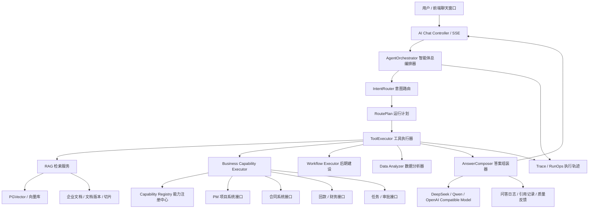

# 企业级 Agent AI 智能助手落地实施方案

> 适用项目：Java / Spring Boot 企业级 PM 系统智能助手  
> 当前基础：已有知识分类、企业文档、文档版本、切片、向量任务、PGVector 写入、发布版本、企业文档问答、SSE 流式问答、问答日志、引用记录等模块  
> 当前阶段约束：暂不优先考虑租户、部门、角色、项目权限；第一阶段先把“能问、能查、能路由、能追踪、能复盘”做扎实  
> 参考方向：EnterpriseAgentFramework / ReachAI 的“业务能力资产化 + Agent 运行时 + Graph 确定性流程 + RunOps/Trace 治理”思想，但不建议第一版直接照搬微服务拆分。

---

## 1. 先给结论：你这个项目应该怎么做

你的项目不要一上来做“万能 Agent”。你现在已经有 RAG 主链路，下一步应该把系统升级成：

**企业 PM 系统 AI 能力中台 + Agent 问答入口。**

核心目标不是让大模型随便发挥，而是让它在受控范围内完成三类事情：

1. **查知识**：走 RAG，回答制度、流程、文档、合同条款、项目说明等非实时知识。
2. **查业务数据**：走业务能力 Tool，查询项目、合同、回款、任务、审批、统计数据。
3. **混合回答**：先查业务数据，再结合 RAG 文档解释，最后由大模型生成自然语言答案和结构化卡片。

第一版要做成下面这种能力：

```text
用户：帮我查一下 XX 项目的合同金额、已回款金额、还差多少，并说明这个项目有没有风险。

系统内部执行：
1. IntentRouter 判断这是 MIXED_QUERY。
2. RoutePlan 规划：查项目 -> 查合同 -> 查回款 -> 检索项目文档/风险制度 -> 汇总分析。
3. ToolExecutor 调业务接口拿真实数据。
4. RAG 检索项目资料和制度。
5. AnswerComposer 生成答案、表格、引用来源、风险说明。
6. Trace 记录每一步，方便复盘。
```

这才是你的 Agent AI 智能助手的正确落地路线。

---

## 2. 参考 EnterpriseAgentFramework 后，你应该吸收什么思想

EnterpriseAgentFramework / ReachAI 的核心价值不是某个具体类怎么写，而是它的架构思想：

| ReachAI 思想 | 你项目里的落地方式 |
|---|---|
| 业务接口不是零散 Tool，而是可治理的 Capability | 建立 `ai_capability_definition` 能力注册表 |
| Agent 不能直接乱调接口，要有运行计划 | 建立 `RoutePlan` 和 `ToolExecutor` |
| AI 可以理解需求，但执行必须确定性 | 查询类 Tool 只读执行；写操作必须确认 |
| 能力变化要可追踪 | 能力表、字段字典、版本号、启停状态 |
| 每次执行要可复盘 | 建立 `ai_run_trace`、`ai_run_step`、`ai_tool_call_log` |
| RAG、Tool、Workflow 要统一编排 | 建立 `AgentOrchestrator` 作为总调度入口 |

你不要第一阶段就照搬它的 `Gateway / MCP / A2A / GraphSpec / Page Bridge` 全套能力。你的第一阶段应该做“轻量 ReachAI”：

```text
你的当前项目
  + AgentOrchestrator
  + IntentRouter
  + RoutePlan
  + Capability Registry
  + ToolExecutor
  + Trace / RunOps
  + RAG + 业务数据混合回答
```

后面系统成熟后，再升级成完整的企业 AI 能力平台。

---

## 3. 总体架构设计

### 3.1 推荐架构图



### 3.2 第一版建议保持“模块化单体”

你现在不建议一开始拆成多个微服务。建议在现有 Spring Boot 项目里按模块包拆分，等稳定后再拆服务。

```text
com.yourcompany.ai
├── chat                  # AI 聊天入口，SSE 输出
├── agent                 # AgentOrchestrator 总编排
├── router                # IntentRouter / RoutePlan
├── capability            # 能力注册中心
├── tool                  # ToolExecutor / ToolDefinition
├── rag                   # 复用你已有的 RAG 服务
├── model                 # 模型网关，DeepSeek / Qwen / OpenAI Compatible
├── memory                # 会话记忆
├── trace                 # 执行轨迹、步骤日志
├── answer                # 答案组装、结构化卡片、引用
├── guard                 # 安全护栏、写操作确认
└── admin                 # 管理端接口，能力管理、路由规则、执行记录
```

---

## 4. 核心模块设计

## 4.1 AgentOrchestrator：智能体总编排器

### 作用

它是整个 Agent 的总入口，负责把一次用户问题变成一次可追踪、可执行、可复盘的运行过程。

### 它要做什么

1. 创建本次运行 `runId`。
2. 读取用户问题、会话上下文、用户身份。
3. 调用 `IntentRouter` 识别意图。
4. 生成 `RoutePlan`。
5. 调用 `ToolExecutor` 按步骤执行。
6. 调用 `AnswerComposer` 生成最终答案。
7. 记录 Trace、问答日志、引用记录。
8. 通过 SSE 流式返回结果。

### 第一版接口

```java
public interface AgentOrchestrator {
    Flux<AgentStreamEvent> chat(AgentRequest request);
}
```

### 输入对象

```java
public class AgentRequest {
    private String conversationId;
    private String userId;
    private String userQuestion;
    private Map<String, Object> pageContext;
    private Map<String, Object> extra;
}
```

### 输出事件

```java
public class AgentStreamEvent {
    private String runId;
    private String type; // THINKING, TOOL_CALL, TOOL_RESULT, ANSWER_DELTA, DONE, ERROR
    private String content;
    private Object data;
}
```

---

## 4.2 IntentRouter：意图路由器

### 作用

判断用户问题到底应该走哪条路线。

### 需要识别的路由类型

| 路由类型 | 场景 | 示例 |
|---|---|---|
| `RAG_ONLY` | 只查文档知识 | “公司的合同审批流程是什么？” |
| `BUSINESS_QUERY` | 只查业务数据 | “查询最近 5 个合同” |
| `MIXED_QUERY` | 业务数据 + 文档解释 | “XX 项目的合同回款情况，并分析风险” |
| `STATISTIC_QUERY` | 统计分析 | “本月合同金额按项目类型统计一下” |
| `WORKFLOW_ACTION` | 执行流程，后期做 | “帮我发起合同审批” |
| `CLARIFY` | 信息不足，需要追问 | “查一下那个项目” |
| `REJECT` | 超出范围或危险操作 | “删除所有合同数据” |

### 第一版不要完全依赖大模型判断

建议使用“三段式路由”：

```text
规则优先 -> 轻量 LLM 分类 -> 兜底保守策略
```

#### 规则优先

通过关键词、实体、业务词典快速判断：

```text
合同、金额、回款、项目编号、任务、审批、统计 => 倾向业务查询
制度、流程、说明、文档、规范、怎么操作 => 倾向 RAG
风险、原因、建议、对比、分析 => 倾向 MIXED
```

#### LLM 分类

让模型只输出 JSON，不要让它直接回答问题。

```json
{
  "routeType": "MIXED_QUERY",
  "confidence": 0.87,
  "reason": "用户需要查询项目真实业务数据，并结合风险规则进行分析",
  "entities": {
    "projectName": "XX项目",
    "metrics": ["contractAmount", "receivedAmount", "risk"]
  },
  "needClarify": false,
  "clarifyQuestion": null
}
```

#### 兜底策略

如果置信度低于 0.65，不要盲目查全部接口，应该追问用户。

```text
我需要确认一下，你是想查项目数据，还是想查项目相关文档说明？
```

---

## 4.3 RoutePlan：运行计划

### 作用

`RoutePlan` 是把用户问题拆成可执行步骤的核心对象。

它解决两个问题：

1. 用户的问题应该走 RAG、业务接口，还是混合？
2. 如果走业务接口，到底调用哪些能力，按什么顺序调用？

### RoutePlan 示例

用户问题：

```text
帮我查一下 A 项目的合同金额、已回款金额、未回款金额，并结合制度说明有没有风险。
```

生成计划：

```json
{
  "routeType": "MIXED_QUERY",
  "goal": "查询项目合同和回款情况，并结合制度分析风险",
  "steps": [
    {
      "stepNo": 1,
      "type": "BUSINESS_TOOL",
      "capabilityCode": "pm.project.getByName",
      "input": {"projectName": "A项目"},
      "outputKey": "project"
    },
    {
      "stepNo": 2,
      "type": "BUSINESS_TOOL",
      "capabilityCode": "pm.contract.listByProjectId",
      "inputRef": {"projectId": "$.project.id"},
      "outputKey": "contracts"
    },
    {
      "stepNo": 3,
      "type": "BUSINESS_TOOL",
      "capabilityCode": "pm.payment.summaryByProjectId",
      "inputRef": {"projectId": "$.project.id"},
      "outputKey": "paymentSummary"
    },
    {
      "stepNo": 4,
      "type": "RAG",
      "query": "项目回款风险 合同回款制度 风险判断规则",
      "outputKey": "riskDocs"
    },
    {
      "stepNo": 5,
      "type": "LLM_SUMMARY",
      "inputKeys": ["project", "contracts", "paymentSummary", "riskDocs"],
      "outputKey": "finalAnswer"
    }
  ]
}
```

### 第一版计划生成方式

第一版不要追求复杂的自主规划，建议使用“模板化计划”。

```text
用户意图 -> 匹配固定业务场景模板 -> 填充参数 -> 执行
```

例如：

| 场景模板 | 用户问题 | 计划步骤 |
|---|---|---|
| 项目概况查询 | “查 XX 项目情况” | 查项目 -> 查合同 -> 查任务 -> 汇总 |
| 合同回款查询 | “XX 项目回款多少” | 查项目 -> 查合同 -> 查回款 -> 计算 |
| 项目风险分析 | “XX 项目有没有风险” | 查项目 -> 查合同/回款/任务 -> 查风险制度 -> 分析 |
| 文档制度问答 | “合同审批流程是什么” | RAG 检索 -> 生成答案 |
| 统计分析 | “本月合同金额统计” | 查统计接口 -> 生成图表数据 |

---

## 4.4 Capability Registry：业务能力注册中心

### 这是你项目下一阶段最重要的模块

你之前的问题是：

> 业务接口返回 JSON 字段都是业务系统自己的字段，大模型怎么知道哪些字段是用户想要的数据？是不是要重新封装接口？

答案是：**不需要全部重新封装接口，但必须建立“业务能力注册 + 字段语义字典”。**

### 能力注册表设计

#### ai_capability_definition

```sql
CREATE TABLE ai_capability_definition (
    id BIGINT PRIMARY KEY AUTO_INCREMENT,
    capability_code VARCHAR(128) NOT NULL UNIQUE COMMENT '能力编码，如 pm.project.getByName',
    capability_name VARCHAR(128) NOT NULL COMMENT '能力名称',
    domain VARCHAR(64) NOT NULL COMMENT '业务域，如 pm/contract/payment',
    module_name VARCHAR(64) COMMENT '模块名称',
    description VARCHAR(512) COMMENT '能力说明，给大模型和开发者看',
    method VARCHAR(16) NOT NULL COMMENT 'GET/POST',
    url VARCHAR(256) NOT NULL COMMENT '真实业务接口地址或内部服务地址',
    side_effect VARCHAR(32) NOT NULL DEFAULT 'READ' COMMENT 'READ/WRITE/DANGEROUS',
    enabled TINYINT NOT NULL DEFAULT 1,
    input_schema_json TEXT COMMENT '入参 JSON Schema',
    output_schema_json TEXT COMMENT '出参 JSON Schema',
    example_json TEXT COMMENT '调用示例',
    created_at DATETIME DEFAULT CURRENT_TIMESTAMP,
    updated_at DATETIME DEFAULT CURRENT_TIMESTAMP ON UPDATE CURRENT_TIMESTAMP
);
```

#### ai_field_dictionary

```sql
CREATE TABLE ai_field_dictionary (
    id BIGINT PRIMARY KEY AUTO_INCREMENT,
    capability_code VARCHAR(128) NOT NULL,
    field_path VARCHAR(256) NOT NULL COMMENT '字段路径，如 $.data.contractAmount',
    field_name VARCHAR(128) NOT NULL COMMENT '字段名，如 contractAmount',
    field_cn_name VARCHAR(128) NOT NULL COMMENT '中文名，如 合同金额',
    field_type VARCHAR(64) COMMENT '字段类型，如 number/string/date',
    business_meaning VARCHAR(512) COMMENT '业务含义',
    display_format VARCHAR(128) COMMENT '展示格式，如 amount/date/percent',
    example_value VARCHAR(256),
    searchable TINYINT DEFAULT 0,
    aggregatable TINYINT DEFAULT 0,
    created_at DATETIME DEFAULT CURRENT_TIMESTAMP
);
```

### 能力注册示例

```json
{
  "capabilityCode": "pm.contract.listByProjectId",
  "capabilityName": "根据项目ID查询合同列表",
  "domain": "contract",
  "description": "用于查询某个项目下的所有合同，包括合同编号、合同名称、合同金额、实际金额、审核状态、上传日期等",
  "method": "GET",
  "url": "/api/contracts?projectId={projectId}",
  "sideEffect": "READ",
  "inputSchema": {
    "projectId": "项目ID，必填"
  },
  "outputFields": [
    {
      "fieldPath": "$.data[].contractName",
      "fieldCnName": "合同名称",
      "businessMeaning": "合同的正式名称"
    },
    {
      "fieldPath": "$.data[].contractAmount",
      "fieldCnName": "合同金额",
      "businessMeaning": "合同签署金额，单位元",
      "displayFormat": "amount"
    },
    {
      "fieldPath": "$.data[].actualAmount",
      "fieldCnName": "实际金额",
      "businessMeaning": "实际确认金额或执行金额，单位元",
      "displayFormat": "amount"
    }
  ]
}
```

这样大模型不需要猜字段含义，你也不用重写所有接口。你只需要把接口的“业务语义”补齐。

---

## 4.5 ToolExecutor：工具执行器

### 作用

ToolExecutor 不负责思考，它只负责安全、稳定、可追踪地执行计划步骤。

### 它要做什么

1. 根据 `capabilityCode` 找到能力定义。
2. 校验能力是否启用。
3. 校验副作用等级，第一版只允许 `READ`。
4. 解析入参，包括用户参数和上一步输出引用。
5. 调用真实业务接口。
6. 标准化返回结果。
7. 记录工具调用日志。
8. 出错时返回结构化错误，不要让系统崩掉。

### 统一返回结构

无论业务系统返回什么格式，ToolExecutor 都要转换成统一结构：

```json
{
  "success": true,
  "capabilityCode": "pm.contract.listByProjectId",
  "data": [],
  "fields": [
    {
      "name": "contractAmount",
      "cnName": "合同金额",
      "type": "number",
      "format": "amount"
    }
  ],
  "summary": "共查询到 5 个合同，合同总金额 1200 万元",
  "raw": {}
}
```

### 建议接口

```java
public interface ToolExecutor {
    ToolResult execute(ToolExecutionContext context, PlanStep step);
}
```

```java
public class ToolExecutionContext {
    private String runId;
    private String userId;
    private Map<String, Object> variables;
    private Map<String, Object> userContext;
}
```

```java
public class ToolResult {
    private boolean success;
    private String capabilityCode;
    private Object data;
    private List<FieldMeta> fields;
    private String summary;
    private String errorCode;
    private String errorMessage;
}
```

---

## 4.6 AnswerComposer：答案组装器

### 作用

把 Tool 结果、RAG 文档、统计结果组合成用户能看懂的答案。

### 第一版输出格式

建议固定为：

```text
1. 结论
2. 关键数据
3. 明细表格
4. 风险/异常说明
5. 数据来源/文档引用
6. 下一步建议
```

### 示例 Prompt

```text
你是企业 PM 系统智能助手。
请基于【业务数据】和【文档引用】回答用户问题。
要求：
1. 不要编造不存在的数据。
2. 业务数据为空时明确说明没有查到。
3. 金额字段统一转换为万元展示。
4. 如果有文档引用，必须说明依据来自哪条文档。
5. 输出结构：结论、关键数据、明细、风险判断、依据来源。

【用户问题】
{question}

【业务数据】
{businessData}

【字段解释】
{fieldDictionary}

【文档引用】
{ragReferences}
```

---

## 5. 阶段实施计划

# 阶段 0：项目定位和边界确认

## 目标

明确第一版不是做完整 AI 平台，而是做一个能落地的 PM 系统 Agent 助手。

## 你要干什么

1. 明确第一版只做 3 个业务域：
   - 项目 `project`
   - 合同 `contract`
   - 回款 `payment`
2. 明确第一版只做只读查询，不做写操作。
3. 明确第一版支持 5 类问题：
   - 企业文档问答
   - 项目信息查询
   - 合同信息查询
   - 回款信息查询
   - 项目风险混合分析
4. 暂不做：
   - 多租户
   - 复杂权限
   - 自动审批/自动删除/自动修改
   - 多 Agent 协作
   - MCP / A2A 对外开放

## 产出物

- `agent_scope.md`：系统边界说明
- 第一版问题清单 50 条
- 第一版业务能力清单 10 个以内

## 验收标准

用户问下面这些问题时，系统能知道该走哪条路：

```text
合同审批流程是什么？
查一下 A 项目的基本信息。
A 项目的合同总额是多少？
A 项目已经回款多少？
A 项目有没有回款风险？
```

---

# 阶段 1：统一 AI 聊天入口

## 目标

把你现有的企业文档问答入口升级成统一 Agent 入口。

## 你要干什么

1. 新增 `AgentChatController`。
2. 保留 SSE 流式输出。
3. 每次问题生成 `runId`。
4. 统一记录用户问题、会话 ID、运行状态。
5. 暂时只接入 RAG，让旧能力通过新入口跑通。

## 代码结构

```text
ai/chat
├── AgentChatController.java
├── AgentRequest.java
├── AgentStreamEvent.java
└── SseEmitterAdapter.java
```

## 接口设计

```http
POST /api/agent/chat/stream
Content-Type: application/json
```

```json
{
  "conversationId": "conv_001",
  "userId": "u001",
  "question": "合同审批流程是什么？"
}
```

## 产出物

- `/api/agent/chat/stream`
- `ai_agent_run` 表
- `ai_agent_message` 表

## 验收标准

旧的 RAG 问答可以通过新的 Agent 入口返回，并且每次请求都有 `runId`。

---

# 阶段 2：IntentRouter 意图识别

## 目标

让系统知道用户问题应该走 RAG、业务查询，还是混合查询。

## 你要干什么

1. 建立 `IntentRouter` 接口。
2. 建立规则分类器 `RuleBasedIntentClassifier`。
3. 建立 LLM 分类器 `LlmIntentClassifier`。
4. 建立路由结果对象 `IntentResult`。
5. 把每次路由结果写入 Trace。

## 建议先写死规则

```java
public enum RouteType {
    RAG_ONLY,
    BUSINESS_QUERY,
    MIXED_QUERY,
    STATISTIC_QUERY,
    WORKFLOW_ACTION,
    CLARIFY,
    REJECT
}
```

```java
public class IntentResult {
    private RouteType routeType;
    private double confidence;
    private String reason;
    private Map<String, Object> entities;
    private boolean needClarify;
    private String clarifyQuestion;
}
```

## 第一版规则示例

```text
包含“流程、制度、规范、怎么操作、说明、文档” -> RAG_ONLY
包含“查询、查一下、多少、列表、金额、回款、合同、项目编号” -> BUSINESS_QUERY
包含“风险、分析、原因、建议、是否异常”且包含业务实体 -> MIXED_QUERY
包含“统计、汇总、占比、趋势、排名” -> STATISTIC_QUERY
包含“删除、修改、发起、提交、审批” -> WORKFLOW_ACTION 或 REJECT
```

## 产出物

- `IntentRouter`
- `IntentResult`
- `RouteType`
- 路由测试用例 50 条

## 验收标准

50 条测试问题，路由准确率达到 85% 以上。

---

# 阶段 3：RoutePlan 运行计划

## 目标

把用户问题转换成可执行步骤。

## 你要干什么

1. 建立 `RoutePlan` 对象。
2. 建立 `PlanStep` 对象。
3. 建立 `PlanTemplateRegistry`。
4. 先用模板生成计划，不要一上来让大模型自由规划。
5. 支持变量引用，例如 `$.project.id`。

## 核心对象

```java
public class RoutePlan {
    private String planId;
    private RouteType routeType;
    private String goal;
    private List<PlanStep> steps;
}
```

```java
public class PlanStep {
    private Integer stepNo;
    private StepType type;
    private String capabilityCode;
    private Map<String, Object> input;
    private Map<String, String> inputRef;
    private String query;
    private String outputKey;
}
```

```java
public enum StepType {
    RAG,
    BUSINESS_TOOL,
    STATISTIC_TOOL,
    LLM_SUMMARY,
    CLARIFY,
    HUMAN_CONFIRM
}
```

## 产出物

- 项目概况查询模板
- 合同列表查询模板
- 回款汇总查询模板
- 项目风险分析模板
- 文档问答模板

## 验收标准

用户问“查 A 项目回款情况并分析风险”，系统能生成 4 到 5 步运行计划。

---

# 阶段 4：业务能力注册中心

## 目标

把 PM 系统已有接口变成 Agent 可理解、可选择、可调用的能力资产。

## 你要干什么

1. 建表：`ai_capability_definition`。
2. 建表：`ai_field_dictionary`。
3. 管理端提供能力新增、编辑、启用、停用。
4. 第一版手工录入 8 到 10 个核心能力。
5. 每个能力必须有：说明、入参、出参字段含义、示例。

## 第一版能力清单

| 能力编码 | 能力名称 | 类型 | 说明 |
|---|---|---|---|
| `pm.project.getByName` | 根据项目名称查项目 | READ | 查询项目基本信息 |
| `pm.project.getByCode` | 根据项目编号查项目 | READ | 查询项目基本信息 |
| `pm.contract.listRecent` | 查询最近合同 | READ | 查询最近 N 个合同 |
| `pm.contract.listByProjectId` | 查询项目合同 | READ | 根据项目 ID 查合同列表 |
| `pm.contract.summaryByProjectId` | 项目合同汇总 | READ | 合同总额、数量、状态汇总 |
| `pm.payment.summaryByProjectId` | 项目回款汇总 | READ | 已回款、未回款、回款率 |
| `pm.task.listByProjectId` | 项目任务列表 | READ | 查询项目任务和状态 |
| `pm.risk.evaluateProject` | 项目风险评估 | READ | 根据合同、回款、任务做规则评估 |

## 产出物

- 能力注册表
- 字段字典表
- 能力管理接口
- 第一批 PM 能力数据

## 验收标准

系统可以根据 `capabilityCode` 找到接口地址、入参规则、出参字段含义，并能展示给大模型使用。

---

# 阶段 5：ToolExecutor 业务工具执行

## 目标

让 Agent 能安全调用真实业务接口。

## 你要干什么

1. 实现 `ToolExecutor`。
2. 实现 `BusinessCapabilityExecutor`。
3. 支持 GET / POST。
4. 支持参数填充。
5. 支持上一步输出引用。
6. 支持统一结果结构。
7. 记录每次调用日志。

## 执行流程

```text
PlanStep
  -> 读取 CapabilityDefinition
  -> 校验 enabled / sideEffect
  -> 解析 input / inputRef
  -> 调用业务接口
  -> 按 FieldDictionary 解释字段
  -> 标准化 ToolResult
  -> 写入 ai_tool_call_log
```

## 产出物

- `ToolExecutor`
- `BusinessCapabilityExecutor`
- `ToolResultNormalizer`
- `ai_tool_call_log` 表

## 验收标准

用户问“查询最近 5 个合同”，系统能真实调用业务接口，返回合同列表和字段解释。

---

# 阶段 6：RAG 和业务数据混合回答

## 目标

让 Agent 不只是查数据，还能结合企业文档进行解释。

## 你要干什么

1. 复用已有 RAG 检索服务。
2. 在 `RoutePlan` 里支持 `RAG` 步骤。
3. RAG 检索结果返回引用来源。
4. `AnswerComposer` 同时接收业务数据和文档片段。
5. 最终答案必须区分“数据结论”和“文档依据”。

## 混合回答示例

```text
用户：A 项目有没有回款风险？

业务数据：
- 合同总额：1200 万
- 已回款：600 万
- 未回款：600 万
- 回款率：50%
- 最近一次回款日期：2026-06-12

文档依据：
- 《项目回款风险管理办法》第 3 条：回款率低于 60% 且超过 30 天无回款记录，需要标记为关注风险。

最终回答：
A 项目存在回款关注风险。主要原因是当前回款率为 50%，低于制度要求的 60%，且最近一次回款距今已超过 30 天。建议项目经理跟进客户付款计划，并在系统中更新下一次预计回款时间。
```

## 产出物

- `MixedAnswerComposer`
- 混合问题 Prompt
- 引用记录增强

## 验收标准

系统能回答“查数据 + 给解释 + 带引用”的复杂问题。

---

# 阶段 7：统计分析和结构化展示

## 目标

支持金额汇总、数量统计、占比、排名、趋势等问题。

## 你要干什么

1. 新增统计类 Capability。
2. 对统计结果输出统一图表数据结构。
3. 前端支持表格、指标卡、简单柱状图/饼图。
4. 大模型只负责解释统计结果，不负责凭空计算原始数据。

## 结构化返回示例

```json
{
  "type": "metric_table",
  "title": "本月合同金额统计",
  "metrics": [
    {"name": "合同数量", "value": 18},
    {"name": "合同总额", "value": 8200000, "format": "amount"}
  ],
  "table": {
    "columns": ["项目类型", "合同数量", "合同金额"],
    "rows": [
      ["施工类", 10, 5200000],
      ["设计类", 5, 1800000],
      ["咨询类", 3, 1200000]
    ]
  }
}
```

## 产出物

- 统计类能力
- `DataAnalyzer`
- 前端结构化卡片协议

## 验收标准

用户问“本月合同金额按项目类型统计”，系统返回统计表格和文字解释。

---

# 阶段 8：Trace / RunOps 执行轨迹

## 目标

每一次 Agent 执行都能复盘。

## 你要干什么

1. 建表 `ai_run_trace`。
2. 建表 `ai_run_step`。
3. 记录每个步骤：输入、输出、耗时、状态、错误。
4. 前端提供运行详情页面。
5. 出错时能定位是路由错、计划错、接口错、RAG 没检索到，还是模型总结错。

## ai_run_trace

```sql
CREATE TABLE ai_run_trace (
    id BIGINT PRIMARY KEY AUTO_INCREMENT,
    run_id VARCHAR(64) NOT NULL UNIQUE,
    conversation_id VARCHAR(64),
    user_id VARCHAR(64),
    question TEXT,
    route_type VARCHAR(64),
    status VARCHAR(32),
    total_duration_ms BIGINT,
    created_at DATETIME DEFAULT CURRENT_TIMESTAMP
);
```

## ai_run_step

```sql
CREATE TABLE ai_run_step (
    id BIGINT PRIMARY KEY AUTO_INCREMENT,
    run_id VARCHAR(64) NOT NULL,
    step_no INT NOT NULL,
    step_type VARCHAR(64),
    capability_code VARCHAR(128),
    input_json TEXT,
    output_json MEDIUMTEXT,
    status VARCHAR(32),
    error_message TEXT,
    duration_ms BIGINT,
    created_at DATETIME DEFAULT CURRENT_TIMESTAMP
);
```

## 产出物

- 执行轨迹表
- 执行步骤表
- 管理端执行详情页

## 验收标准

任意一次问答，都能看到完整链路：路由结果、计划步骤、工具调用、RAG 引用、最终答案。

---

# 阶段 9：安全护栏和写操作确认

## 目标

后期支持发起审批、提交流程、更新任务，但必须安全。

## 你要干什么

1. 所有 Capability 增加 `sideEffect` 字段。
2. 第一版默认只允许 `READ`。
3. `WRITE` 操作必须走 `HUMAN_CONFIRM`。
4. `DANGEROUS` 操作直接拒绝或仅管理员可用。
5. 写操作执行前展示影响范围。

## 副作用等级

| 等级 | 含义 | 是否允许自动执行 |
|---|---|---|
| `READ` | 查询数据 | 允许 |
| `WRITE` | 新增、修改、提交 | 需要用户确认 |
| `DANGEROUS` | 删除、批量修改、不可逆操作 | 第一版禁止 |

## 写操作确认示例

```text
我将为 A 项目发起合同审批流程：
- 合同名称：XXX 合同
- 合同金额：120 万元
- 审批人：张三、李四

请确认是否继续？
[确认提交] [取消]
```

## 产出物

- `GuardService`
- `HumanConfirmStep`
- 写操作确认卡片

## 验收标准

任何写操作都不会被 Agent 自动执行，必须经过用户明确确认。

---

# 阶段 10：Workflow / GraphSpec 确定性流程

## 目标

当单次 Tool 调用无法满足复杂业务时，用工作流固化流程。

## 什么时候做

不要第一版就做。建议在下面场景出现后再做：

1. 一个问题需要稳定调用 3 个以上接口。
2. 接口之间有固定依赖关系。
3. 需要条件分支。
4. 需要人工确认。
5. 需要失败重试和回滚。

## 你项目里的 GraphSpec 可以先做轻量版

```json
{
  "workflowCode": "project_risk_analysis",
  "name": "项目风险分析流程",
  "nodes": [
    {"id": "n1", "type": "tool", "capabilityCode": "pm.project.getByName"},
    {"id": "n2", "type": "tool", "capabilityCode": "pm.contract.summaryByProjectId"},
    {"id": "n3", "type": "tool", "capabilityCode": "pm.payment.summaryByProjectId"},
    {"id": "n4", "type": "rag", "query": "项目回款风险规则"},
    {"id": "n5", "type": "llm_summary"}
  ],
  "edges": [
    {"from": "n1", "to": "n2"},
    {"from": "n1", "to": "n3"},
    {"from": "n2", "to": "n5"},
    {"from": "n3", "to": "n5"},
    {"from": "n4", "to": "n5"}
  ]
}
```

## 产出物

- 工作流定义表
- 工作流执行器
- 工作流版本表
- 工作流运行轨迹

## 验收标准

项目风险分析可以通过固定 Workflow 执行，而不是每次都让模型重新规划。

---

# 阶段 11：管理端建设

## 目标

让系统可配置、可运营、可排查。

## 你要干什么

在你已有 RAG 后台基础上，增加 Agent 管理页面：

1. 能力注册管理
2. 字段字典管理
3. 路由规则管理
4. Prompt 模板管理
5. 执行轨迹管理
6. Tool 调用日志
7. 问答质量反馈
8. 测试用例集

## 菜单建议

```text
AI 智能助手
├── Agent 总览
├── 能力资产管理
│   ├── 业务能力列表
│   ├── 字段语义字典
│   └── 能力调用测试
├── 路由与计划
│   ├── 意图路由规则
│   ├── 计划模板管理
│   └── Prompt 模板管理
├── 运行中心
│   ├── 执行轨迹
│   ├── Tool 调用日志
│   └── 异常问题排查
└── 质量运营
    ├── 问答日志
    ├── 用户反馈
    └── 测试集评估
```

## 产出物

- Agent 管理菜单
- 能力管理页面
- 运行轨迹页面
- 测试集页面

## 验收标准

开发人员不用查数据库，就能在页面上看到 Agent 为什么这样回答。

---

# 阶段 12：测试集、评估和上线

## 目标

让系统从“能跑”变成“可上线”。

## 你要干什么

1. 准备 100 条真实业务问题。
2. 每条问题标注期望路由。
3. 每条问题标注期望调用能力。
4. 每条问题标注期望答案要点。
5. 每次改 Prompt、路由规则、Tool 后跑回归测试。

## 测试维度

| 维度 | 指标 |
|---|---|
| 路由准确率 | 是否走对 RAG / Business / Mixed |
| Tool 选择准确率 | 是否调对业务能力 |
| 参数抽取准确率 | 项目名、编号、时间范围是否正确 |
| 答案真实性 | 是否基于真实数据回答 |
| 引用准确性 | 文档引用是否对应答案 |
| 稳定性 | 相同问题多次结果是否一致 |
| 性能 | 首字响应、总耗时 |

## 上线门槛

| 指标 | 第一版目标 |
|---|---|
| 路由准确率 | >= 85% |
| 业务 Tool 调用成功率 | >= 95% |
| RAG 引用命中率 | >= 80% |
| P95 总响应耗时 | <= 8 秒 |
| 严重幻觉率 | 0 |
| 写操作误执行 | 0 |

---

## 6. 第一版 MVP 开发顺序

你现在最应该按这个顺序做：

```text
第 1 步：统一 AgentChatController，复用现有 RAG。
第 2 步：加 IntentRouter，能判断 RAG / BUSINESS / MIXED。
第 3 步：加 RoutePlan，用模板生成执行步骤。
第 4 步：建 Capability Registry，录入项目、合同、回款能力。
第 5 步：实现 ToolExecutor，能调用真实业务接口。
第 6 步：实现业务数据 + RAG 混合回答。
第 7 步：加 Trace / RunOps，能复盘每一步。
第 8 步：管理端补能力管理和执行轨迹。
第 9 步：补测试集和评估。
第 10 步：再考虑 Workflow / GraphSpec / 写操作确认。
```

---

## 7. 第一批接口能力建议

## 7.1 项目能力

```text
pm.project.getByName
pm.project.getByCode
pm.project.search
pm.project.summary
```

## 7.2 合同能力

```text
pm.contract.listRecent
pm.contract.listByProjectId
pm.contract.summaryByProjectId
pm.contract.getByContractNo
```

## 7.3 回款能力

```text
pm.payment.listByProjectId
pm.payment.summaryByProjectId
pm.payment.overdueList
```

## 7.4 风险能力

```text
pm.risk.evaluateProject
pm.risk.evaluatePayment
```

风险能力第一版可以先不是 AI，而是 Java 规则：

```java
if (paymentRate.compareTo(new BigDecimal("0.6")) < 0 && daysSinceLastPayment > 30) {
    riskLevel = "关注风险";
}
```

---

## 8. Prompt 设计建议

## 8.1 路由 Prompt

```text
你是企业 PM 系统的意图路由器。
你只负责判断用户问题应该走哪类处理流程，不要回答用户问题。

可选 routeType：
- RAG_ONLY：企业文档、制度、流程、规范问答
- BUSINESS_QUERY：查询真实业务数据
- MIXED_QUERY：业务数据 + 文档解释 + 风险分析
- STATISTIC_QUERY：统计、汇总、排名、趋势
- WORKFLOW_ACTION：发起、提交、审批、修改等动作
- CLARIFY：信息不足，需要追问
- REJECT：危险或超出范围

请只输出 JSON。

用户问题：{question}
```

## 8.2 答案生成 Prompt

```text
你是企业 PM 系统智能助手。
你必须基于系统提供的数据回答，不能编造。

回答规则：
1. 如果业务数据为空，明确说没有查到。
2. 如果文档依据为空，不要伪造引用。
3. 金额用万元展示，保留两位小数。
4. 先给结论，再给明细。
5. 风险判断必须说明依据。

用户问题：
{question}

业务数据：
{businessData}

字段语义：
{fieldDictionary}

文档引用：
{references}
```

---

## 9. 关键风险和解决方案

| 风险 | 表现 | 解决方案 |
|---|---|---|
| 大模型选错接口 | 问合同却调项目接口 | 规则路由 + 能力描述 + 测试集 |
| 字段看不懂 | JSON 字段名不标准 | 字段语义字典 |
| 接口太多难维护 | 每个接口都写 Tool | 能力注册中心 + 通用 HTTP ToolExecutor |
| 幻觉 | 没数据也回答 | Prompt 约束 + 空数据判断 + 引用机制 |
| 调用链路难排查 | 不知道错在哪 | Trace / RunOps |
| 写操作风险 | Agent 自动提交审批 | sideEffect + HumanConfirm |
| 性能慢 | RAG + 多接口耗时长 | 并行执行、缓存、模板计划、摘要字段 |

---

## 10. 你现在立即该做的事情

## 第一天

1. 新建 `ai-agent` 包。
2. 新建 `AgentChatController`。
3. 新建 `AgentOrchestrator`。
4. 让旧 RAG 问答从新入口跑通。
5. 每次请求生成 `runId`。

## 第二天

1. 新建 `IntentRouter`。
2. 写规则路由。
3. 准备 50 条测试问题。
4. 跑路由测试。

## 第三天

1. 新建 `RoutePlan`。
2. 写 3 个模板：文档问答、项目查询、合同查询。
3. 打印计划步骤，不急着执行。

## 第四天

1. 建 `ai_capability_definition`。
2. 建 `ai_field_dictionary`。
3. 手工录入 5 个业务能力。

## 第五天

1. 写 `BusinessCapabilityExecutor`。
2. 能根据能力编码调真实接口。
3. 返回统一 `ToolResult`。

## 第六天

1. 打通“查询最近 5 个合同”。
2. 打通“查询 A 项目合同”。
3. 打通“查询 A 项目回款”。

## 第七天

1. 做混合回答。
2. 做执行轨迹。
3. 整理第一版 Demo。

---

## 11. 推荐最终目录结构

```text
src/main/java/com/company/pm/ai
├── chat
│   ├── AgentChatController.java
│   ├── AgentRequest.java
│   └── AgentStreamEvent.java
├── agent
│   ├── AgentOrchestrator.java
│   └── DefaultAgentOrchestrator.java
├── router
│   ├── IntentRouter.java
│   ├── RuleBasedIntentRouter.java
│   ├── LlmIntentRouter.java
│   ├── IntentResult.java
│   └── RouteType.java
├── plan
│   ├── RoutePlan.java
│   ├── PlanStep.java
│   ├── StepType.java
│   └── PlanTemplateRegistry.java
├── capability
│   ├── CapabilityDefinition.java
│   ├── CapabilityRepository.java
│   ├── CapabilityService.java
│   └── FieldDictionaryService.java
├── tool
│   ├── ToolExecutor.java
│   ├── BusinessCapabilityExecutor.java
│   ├── RagToolExecutor.java
│   ├── ToolResult.java
│   └── ToolResultNormalizer.java
├── answer
│   ├── AnswerComposer.java
│   ├── MixedAnswerComposer.java
│   └── AnswerPromptBuilder.java
├── trace
│   ├── RunTraceService.java
│   ├── RunStepRecorder.java
│   └── TraceContext.java
├── guard
│   ├── GuardService.java
│   └── SideEffectLevel.java
└── admin
    ├── CapabilityAdminController.java
    ├── RouteRuleAdminController.java
    └── RunTraceAdminController.java
```

---

## 12. 最终形态

你的系统最终会变成：

```text
企业文档 RAG 系统
  -> 企业知识问答系统
  -> 企业业务数据问答系统
  -> 企业 Agent 智能助手
  -> 企业 AI 能力治理平台
```

最重要的路线是：

```text
先把业务能力注册清楚
再把路由做好
再把 Tool 执行做好
再把 RAG 和业务数据混合回答做好
最后再做 Workflow、写操作、MCP/A2A、页面助手
```

不要一开始追求“大而全”，要先做一个能在你 PM 系统里真实查数据、真实回答、真实可复盘的 Agent。

---

## 13. 参考资料

- EnterpriseAgentFramework / ReachAI：<https://github.com/w8123/EnterpriseAgentFramework>
- EnterpriseAgentFramework 项目注册与能力资产文档：<https://github.com/w8123/EnterpriseAgentFramework/blob/main/docs/02-%E9%A1%B9%E7%9B%AE%E6%B3%A8%E5%86%8C%E4%B8%8E%E8%83%BD%E5%8A%9B%E8%B5%84%E4%BA%A7.md>
- Spring AI Tool Calling：<https://docs.spring.io/spring-ai/reference/api/tools.html>
- Spring AI DeepSeek：<https://docs.spring.io/spring-ai/reference/api/chat/deepseek-chat.html>
- Spring AI Alibaba：<https://github.com/alibaba/spring-ai-alibaba>
